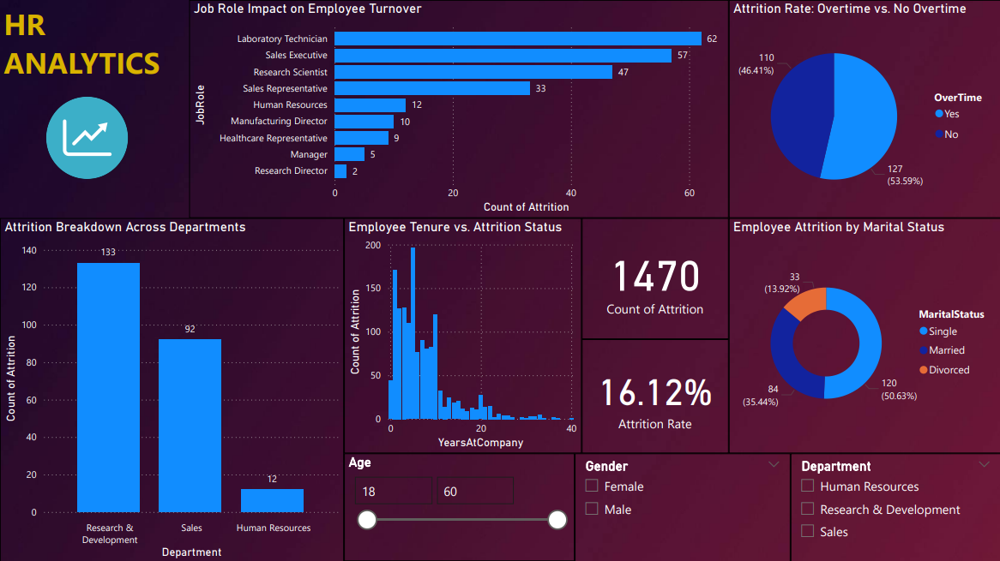

# 💼 HR Analytics: Employee Attrition Prediction

 <!-- Replace with your actual image path -->

## 📌 Overview

This project focuses on analyzing employee attrition using a combination of **machine learning**, **exploratory data analysis (EDA)**, and **interactive dashboards**. It aims to uncover the key factors that lead to employee turnover and provides a comprehensive, data-driven framework for understanding and addressing these issues.

Using a classification model trained on real HR data, the system predicts whether an employee is likely to leave the organization. It also includes interpretability features using SHAP values, making the model decisions transparent to HR teams and leadership. An interactive **Power BI dashboard** is also developed for deeper visual insights into attrition trends across departments, roles, and demographic groups.

The project also includes a list of actionable prevention strategies backed by data, which helps HR professionals make better decisions to improve retention, satisfaction, and overall organizational stability.

---

## 🔍 Objectives

- Predict which employees are at risk of attrition using ML models
- Analyze key contributors such as salary, job role, overtime, etc.
- Visualize data through interactive dashboards
- Recommend actionable strategies to reduce turnover

---

## 🧠 Machine Learning Model

- **Model Used**: Decision Tree Classifier
- **Accuracy**: 81%
- **Evaluation Metrics**:
  - Precision (Class 1 – Attrition): 0.37
  - Recall (Class 1 – Attrition): 0.25
- **Interpretability**: SHAP (SHapley Additive exPlanations) used to analyze feature importance for model predictions

---

## 📊 Power BI Dashboard Features

- Attrition breakdown by:
  - Department
  - Job Role
  - Overtime
  - Age group
  - Marital Status
- Dynamic filtering and slicing
- Visual impact of job satisfaction, environment satisfaction, and years at company

---

## 📈 SHAP Value Insights

The SHAP analysis highlights the most impactful factors contributing to employee attrition:

- 🕒 **Overtime**
- 💸 **Monthly Income**
- 🏢 **Years at Company**
- 💼 **Job Role**
- 🏙️ **Environment Satisfaction**
- 👤 **Age**
- 🪜 **Years Since Last Promotion**

These SHAP values were visualized and exported for integration into Power BI for stakeholder analysis and business intelligence reporting.

---

## 📘 Attrition Prevention Recommendations

Based on the EDA and SHAP analysis, the following actionable strategies were developed to prevent attrition:

### ✅ Work-Life Balance
- Manage excessive overtime through monitoring
- Provide remote work or flexible working hours

### ✅ Fair Compensation
- Benchmark salaries regularly with market standards
- Make pay structures and benefits transparent to all employees

### ✅ Career Development
- Encourage internal job mobility and cross-department roles
- Establish clear promotion paths and development pipelines

### ✅ Managerial Training
- Train managers in employee engagement and career planning
- Improve regular feedback cycles and 1-on-1 reviews

### ✅ Commute and Travel Adjustments
- Offer hybrid or remote work options
- Limit unnecessary business travel through virtual alternatives

---

## ⚙️ Tools & Technologies

| Tool | Purpose |
|------|---------|
| **Python** | Data analysis, model training |
| `pandas`, `seaborn`, `scikit-learn` | Data wrangling and model building |
| `SHAP` | Model explainability |
| **Jupyter Notebook** | EDA and model experimentation |
| **Power BI** | Interactive visualizations and dashboards |

---
